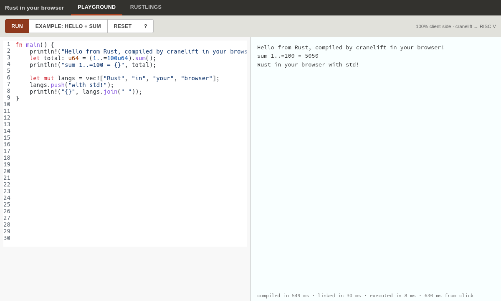
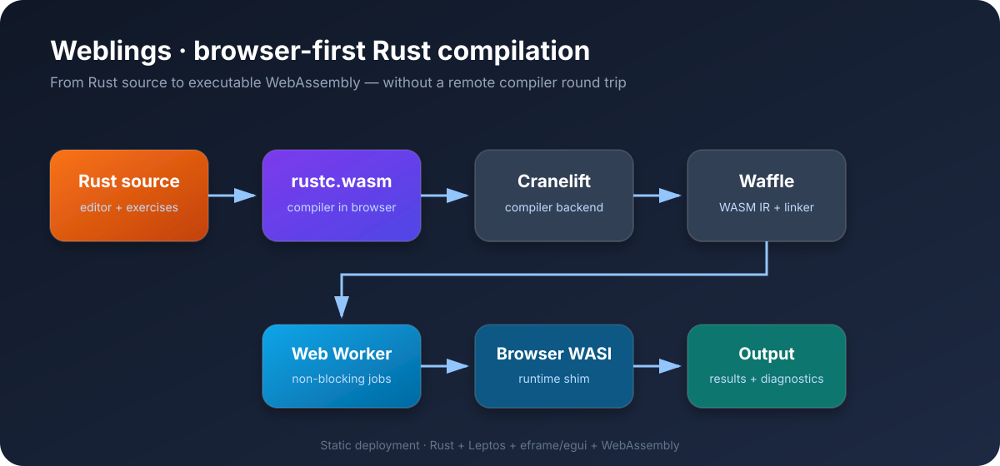

# Weblings

<p align="center">
  
</p>

<p align="center">
  <strong>Compile and run Rust directly in your browser with WebAssembly.</strong><br>
  A browser-first Rust playground and Rustlings trainer powered by a Rust compiler compiled to WASM.
</p>

<p align="center">
  <a href="https://github.com/Quincunx33/weblings-wasm"></a>
  <a href="https://www.rust-lang.org/"></a>
  <a href="LICENSE"></a>
</p>

## What is Weblings?

Weblings is an in-browser Rust learning environment. It combines a Rust playground with a Rustlings-style exercise trainer, while moving compilation and execution into the browser through WebAssembly.

Unlike a traditional online compiler, the playground does not need to send each snippet to a remote compilation server. The browser loads the WASM compiler toolchain, compiles the code in a Web Worker, and displays the output and diagnostics in the UI.

## Highlights

- **Rust Playground:** write, compile, and run Rust code in the browser.
- **Rustlings trainer:** work through interactive Rust exercises with immediate feedback.
- **Browser-side compilation:** Rust compiler execution is powered by `rustc.wasm`.
- **Responsive UI:** Leptos provides the application shell and eframe/egui powers the code editor.
- **Non-blocking execution:** compilation runs in a dedicated Web Worker and can be cancelled.
- **WASI compatibility:** a browser WASI shim provides the runtime interfaces required by compiled programs.
- **Static deployment:** the generated `dist/` directory can be served by any static host.

## Architecture

<p align="center">
  
</p>

```text
Rust source → rustc.wasm → Cranelift IR → Waffle → WASM executable
     │                                                     │
     └──────── Web Worker + browser WASI shim ◄────────────┘
                           │
                           ▼
                    Output and diagnostics
```

## Quick start

### Prerequisites

- Rust toolchain with the `wasm32-unknown-unknown` target
- [Trunk](https://trunkrs.dev/)
- A C linker/build toolchain (`build-essential` on Debian/Ubuntu)

### Build the web app

```bash
rustup target add wasm32-unknown-unknown
cargo install trunk --locked

cd app
trunk build --release
```

The production files are copied to the repository root for simple static hosting. The root `index.html` is the deploy entry point; the root `runner.js`, `worker.js`, `rustc/`, `rustlings/`, `vendor/`, and `*.wasm` files are the browser runtime.

### Run locally

```bash
python3 -m http.server 8090
```

Open `http://localhost:8090/`. A static server is required because browsers do not allow the module, worker, and WASM assets to run correctly from `file://` URLs.

### Host it

The repository root is already deploy-ready. It can be hosted on GitHub Pages, Cloudflare Pages, Netlify, Vercel static hosting, or any Nginx/Apache static server. GitHub Pages deployment is configured in `.github/workflows/deploy-pages.yml` and runs automatically on pushes to `main`.

## Project layout

| Path | Purpose |
| --- | --- |
| `index.html` | Root hosting entry point |
| `*.wasm` | Browser UI WebAssembly module |
| `rustc/` | Browser Rust compiler and sysroot bundle |
| `runner.js` / `worker.js` | Runtime preload, worker pool, and execution |
| `rustlings/` / `vendor/` | Exercises and browser WASI shim |
| `app/src/` | Leptos UI, editor, diagnostics, and Rustlings views |
| `app/public/runner.js` | Browser-side compiler preload and worker pool |
| `app/public/worker.js` | Compilation and program execution worker |
| `app/public/vendor/browser_wasi_shim/` | Browser WASI implementation |
| `app/index.html` | Static shell and application styling |
| `xtask/` | Build-time compiler/sysroot asset preparation |
| `app/verify/` | Verification assets and screenshots |

## Why WASM?

WebAssembly makes it possible to package a meaningful part of the Rust toolchain for browser execution. This gives learners fast feedback, avoids sending source code to a compilation service for every run, and makes the application deployable as a static website.

The initial download is intentionally substantial because the browser needs the compiler and standard-library assets. Once cached, subsequent runs can reuse those assets locally.

## Technology stack

- **Rust** — application and toolchain integration
- **WebAssembly** — browser execution target
- **Leptos** — reactive web UI
- **eframe / egui** — code editor and canvas UI
- **Cranelift** — compiler backend
- **Waffle** — intermediate representation and WASM generation
- **Trunk** — Rust-to-WASM bundling and development server

## Credits and prior art

The project builds on the work of [@bjorn3](https://github.com/bjorn3) and the patched Rust compiler work in [wasm-rustc](https://github.com/AngelOnFira/wasm-rustc). The Cranelift-to-Waffle direction and WASM linker work are based on research and experimentation in the Rust and Bytecode Alliance ecosystems.

Related projects include [rubrc](https://github.com/oligamiq/rubrc) and [rubri](https://github.com/lyonsyonii/rubri).

## License

See [LICENSE](LICENSE).
